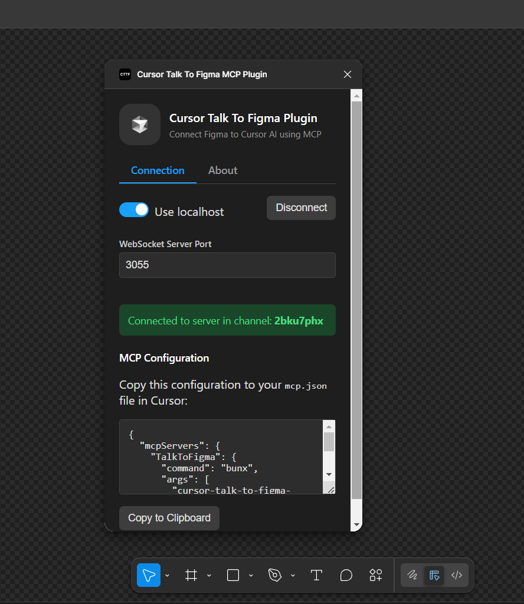
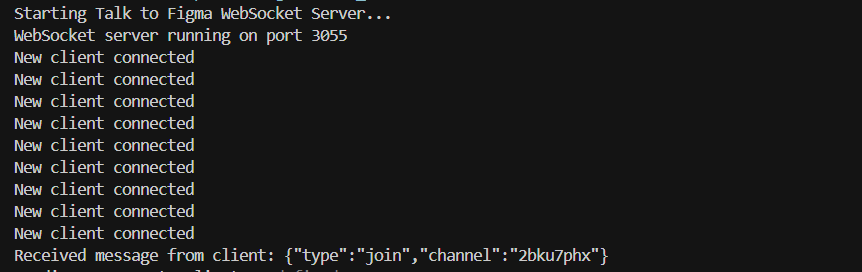
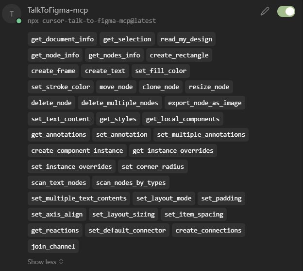
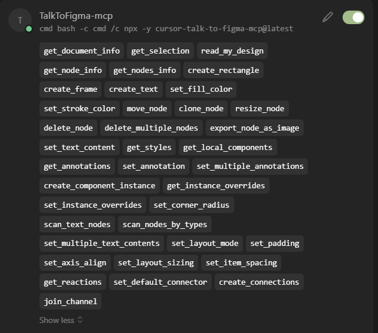

# Cursor Talk to Figma MCP

> **Note:** This repository was created solely to make the MCP integration work via the `npx` command instead of `bunx` for easier compatibility and setup.

A Model Context Protocol (MCP) integration that allows Cursor AI to communicate with Figma for reading and modifying designs programmatically.

---

**Prerequisite:**

You need [Node.js](https://nodejs.org/) (which includes `npx`) installed on your system. Download and install it from the [official Node.js website](https://nodejs.org/). After installation, make sure the installation path for Node.js and npm is added to your system's environment PATH variable so you can run `node`, `npm`, and `npx` from any terminal window.

> **Default installation paths:**
> - **Windows:** `C:\Program Files\nodejs\`
> - **macOS/Linux:** `/usr/local/bin/` (or wherever your package manager installs global binaries)

You can check your versions with:

```bash
node -v
npx -v
```

---

**Screenshots:**

- 

  *Figma plugin with 'Use localhost' enabled*
- 

  *Running MCP via npx in terminal*
- 

  *MCP server running via npx*
- 

  *MCP server running via cmd and npx on Windows*

---

## Installation via NPX

Follow these steps to install and set up the Cursor Talk to Figma MCP:

### 1. Start the WebSocket Server

The WebSocket server facilitates communication between Cursor and Figma.

1. Download the `node_socket_server.mjs` file to your computer
2. Open a terminal/command prompt and navigate to the directory containing the file
3. Start the server with Node.js:

```bash
node node_socket_server.mjs
```

Alternatively, create a batch file (Windows) or shell script (Mac/Linux) for easy startup.

### 2. Configure Cursor MCP Server

1. In Cursor, navigate to Settings > MCPServers
2. Add a new MCP server configuration:

```json
{
  "mcpServers": {
    "TalkToFigma": {
      "command": "npx",
      "args": [
        "cursor-talk-to-figma-mcp@latest"
      ]
    }
  }
}
```

> **Tip:** You can also run this MCP using `cmd` for compatibility on Windows systems. Here is an example `mcpServers` configuration for Cursor:
>
> ```json
> {
>   "mcpServers": {
>     "TalkToFigma-mcp": {
>       "command": "cmd",
>       "args": [
>         "bash",
>         "-c",
>         "cmd /c npx -y cursor-talk-to-figma-mcp@latest"
>       ]
>     }
>   }
> }
> ```
> This allows you to invoke the MCP server through `cmd` using `npx`, which is especially useful if you encounter compatibility issues with other shells or environments on Windows.

### 3. Install the Figma Plugin

Option 1: Install from Figma Community
1. Visit the [Cursor Talk to Figma MCP Plugin](https://www.figma.com/community/plugin/1485687494525374295/cursor-talk-to-figma-mcp-plugin) on Figma Community
2. Click "Install" to add it to your Figma plugins

Option 2: Install Locally
1. In Figma, go to Plugins > Development > New Plugin
2. Choose "Link existing plugin"
3. Select the `manifest.json` file from the `src/cursor_mcp_plugin` directory
4. The plugin will now appear in your Figma development plugins

### 4. Connect Cursor to Figma

1. Open Figma and run the Cursor Talk To Figma MCP Plugin
2. In the plugin panel, ensure "Use localhost" is enabled on 3055 port
3. Note the channel name shown in the green connected status message (e.g., "959ykpvn")
4. In Cursor, join the channel by typing:

```
mcp_TalkToFigma-mcp_join_channel with channel: "[CHANNEL_NAME]"
```

Replace [CHANNEL_NAME] with the channel name from the Figma plugin.

## Usage

After connecting, you can use any of the available MCP commands in Cursor to interact with your Figma design. Here are some examples:

```
mcp_TalkToFigma-mcp_get_document_info
```
Gets information about the current Figma document

```
mcp_TalkToFigma-mcp_get_selection
```
Gets information about the currently selected elements

```
mcp_TalkToFigma-mcp_create_rectangle with x: 100, y: 100, width: 200, height: 100
```
Creates a new rectangle at the specified position and size

```
mcp_TalkToFigma-mcp_create_text with x: 100, y: 100, text: "Hello World"
```
Creates a new text element with the specified text

## Available Commands

The MCP integration provides a wide range of commands for:

- Reading document and selection information
- Creating and modifying design elements
- Working with text, colors, and styles
- Managing auto-layout properties
- Handling component instances and overrides
- Creating and managing annotations
- Exporting designs as images

For a complete list of available commands and their parameters, refer to the [full documentation](https://github.com/sonnylazuardi/cursor-talk-to-figma-mcp).

## Troubleshooting

- If you see "Must join a channel" errors, make sure you've joined the correct channel from the Figma plugin
- If the WebSocket server disconnects, restart it and reconnect the plugin
- If Cursor can't find the MCP server, verify your MCPServers configuration
- Ensure that port 3055 is available for the WebSocket server

## License

[MIT License](LICENSE) 

---

## Credits

All credits go to [sonnylazuardi/cursor-talk-to-figma-mcp](https://github.com/sonnylazuardi/cursor-talk-to-figma-mcp), as this project was cloned from their repository: https://github.com/sonnylazuardi/cursor-talk-to-figma-mcp.git

This fork was made solely to enable MCP usage via `npx` instead of `bunx`.

This allows you to invoke the MCP server through `cmd` using `npx`, which is especially useful if you encounter compatibility issues with other shells or environments on Windows. 